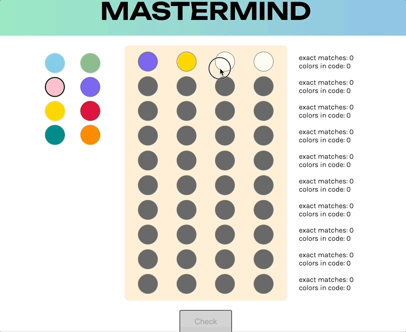

To run the code: 

1. In your terminal: 
    $ git clone https://github.com/eebrownl/mastermind-game

2. cd into the folder and install project's dependencies:
    $ npm install

3. Run the project:
    $ npm start

Tools used: 

1. React
2. Styled-components

I chose to do this project in React because that is what I have been focusing on learning recently and this seemed like an excellent opportunity to extend that learning. I had never used Styled-components before this project, but it is something that I had been wanting to try out so I decided to read some documentation and give it a go. 

Process: 

Once I wrapped my head around what the challenge was asking me to do, I decided to spend the first couple of days trying out a couple of design patterns for my app to see what I thought would work best. I made a list of the various components I would need, and thought through how I could take in user input and pass that data around. My first attempt ended up being very similar (in the earliest stages) to the app I eventually created, but I abandoned it early because I wanted to try organizing all of my components into rows, which was my second attempt. In building a row out of various components and then building the board out of those rows, it was really easy to get everything I needed on the board and looking nice, but it made it unnecessarily difficult to keep data attached to the correct elements. 

By day 2 I had decided that the pattern that would work best for me in this project would be to create a series of objects to hold the data for each of the board elements (so each board button would be an object with an id and value, etc.) which I could create with a simple C-style 'for' loop for each type of component and then push them into an array. I would then map over those arrays of objects to create each instance of a component on the board. That way of building the board made it easy to change the values of targeted elements because they already had an id and a value attached to them. 

Once I had my elements created, I went about writing the behind the scenes logic. I've been spoiled in my short programming life and have always received outside data as JSON, so figuring out how to get the plaintext column of strings that I received from random.org into a usable format gave me a few gray hairs. The rest of the behind the scenes logic was really fun to figure out!

Once I finished getting all of the parts of the board working, I set to work on styling it. I remade some components that I had previously made by making them styled components. It was my first time trying styled components, and I really liked the simplicity of the CSS in JS format. I particularly liked not having to create and keep track of tons of classNames. I will be using styled components a lot more after this project! Once those components were remade and styled it was just a matter of getting my grid set up how I wanted and thinking about how I could conditionally render different parts in order to be efficient with the space on the screen.

Challenges: 

My first real challenge that I ran into was transferring the data from the selected "colorPicker" radio button to a button on the board that a user clicked. I thought I had solved this problem: I held the selected color from the color picker in state, then I just pushed that value into an array on a board click, then I could check that array against the secret code when the turn was over. It took me a while to realize that the values weren't going into the array in the order they appeared on the board, but rather in the order they were clicked, so I was getting bad data when I checked that array against the secret code. I could have easily solved that problem by only enabling one button on the board at a time rather than enabling the entire current row, but I didn't like that UX, so I figured out how to assign the values to the board button objects and update the array to check from those objects on each click of a board button.

A real low point for me was getting myself banned from random.org. I was fiddling with my fetch function to figure out how to get a new secret code when the 'play again' button was clicked, and I accidentally moved it outside of its useEffect. I knew better... Luckily a very kind person was responding to desperate emails on a Saturday and I was reinstated.

Extensions: 

The project offered a wide range of possibilities, but I wanted it to have a bit of the feel of the original game. While all of the logic for the game is written using numbers, I decided to use colored pegs in the UI to make it feel more like the game itself. The color options are radio buttons, which I chose because I only want the user to be able to choose one at a time. I gave the radio button itself an appearance: none, then I styled the label to surround the radio button and mirror the style of the board buttons. I could then take the input from that radio button, save it in state, then transfer the data to a board button when it is clicked. For both the radio buttons on the side and the board buttons I used a simple switch function in the styling in order to assign a color value to the underlying numbers. 

I'm not sure if these would be considered extensions, but I chose to do a few more things that were not explicitly asked for. Upon either a win or a loss I conditionally render the secret code onto the screen so that the user can look back at their guesses and see what went right or wrong. After the game is over the user has the option to play the game again, and everything is reset. I also added some confetti on a win, because who doesn't love some confetti?!
